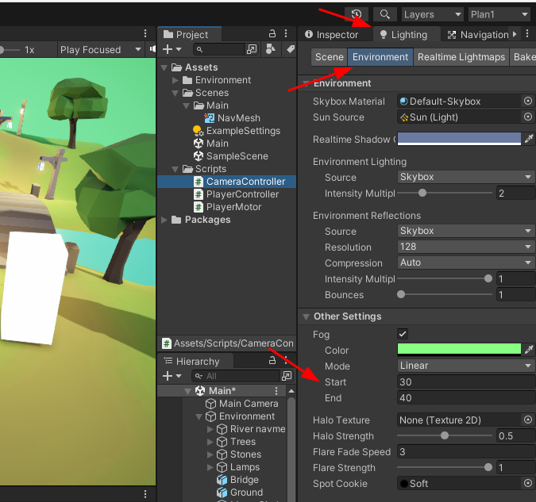
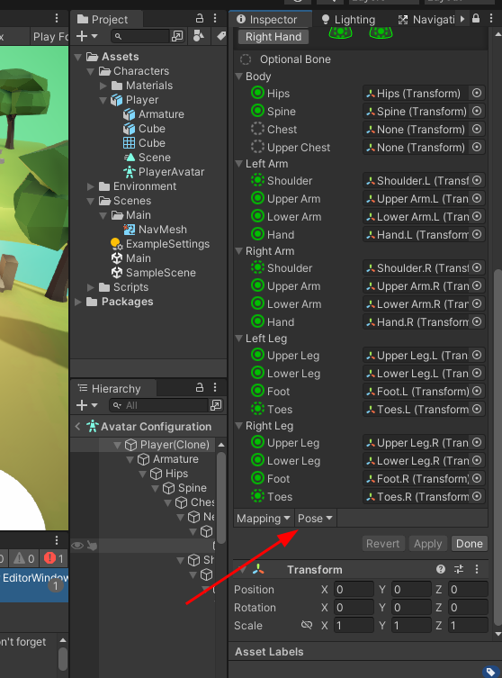
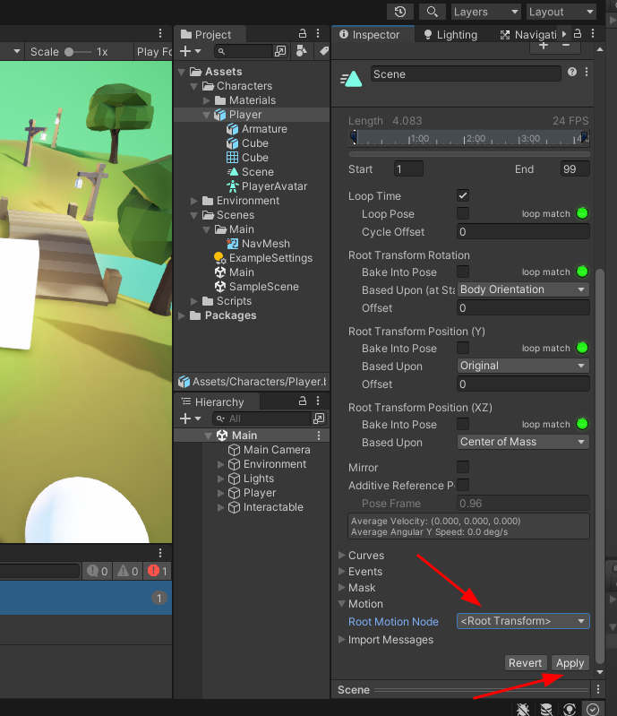
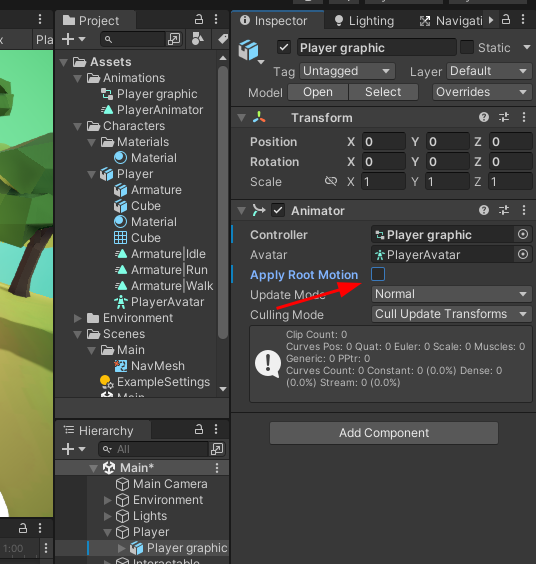
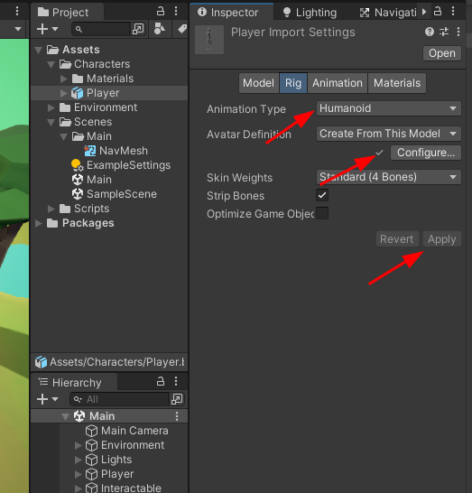
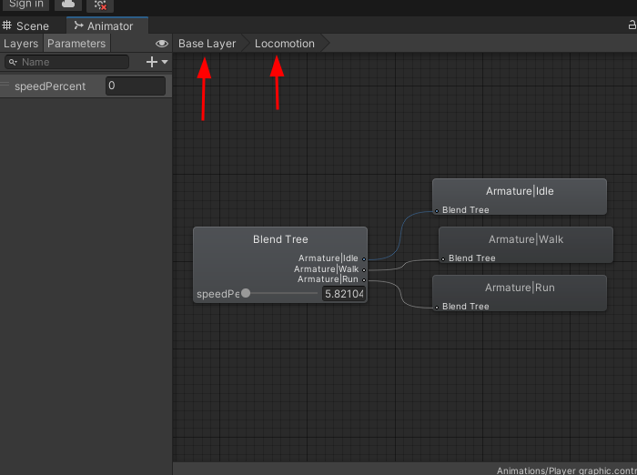
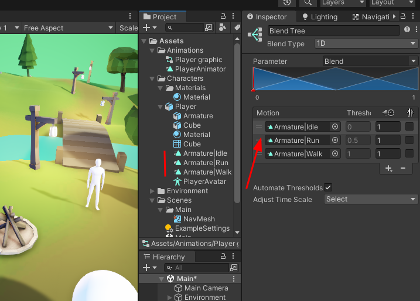

## Notes

### Ep 01

- Download assets https://devassets.com/assets/rpg-tutorial-assets/ and import unit package

- Change **colorset** from gamma to linear, *Project Settings > Player > Other Settings > Color Space*
- 
- Enable **pivot** to see the origin at the bottom

- Player
  - Add capsule collider
  - Add Rigidbody: Enable is Kinematic to make it works with the 
  - Add Nav Mesh Agent: this allows player movements
    - To set the walkable space:
      - Add Navigation window
      - To see the walkable areas *Navgation > Bake > Bake button*
      - Object marked as static: *Navigation > Object > Navigation Area*
      - Nav Mesh Obstacle and check carv to create an unwalkable area that updates in RT
  
- Raycasting: Add new layer called Ground

- New concepts
  - UnityEngine.AI, NavMeshAgent
  - RaycastHit, Ray, Physics.Raycast(), LayerMask
  - Camera concepts:
    - zoom
    - yaw
    - pitch

- To change the fog: 
    

- Hints
  - In play mode copy component values and paste them after in edit mode

### Ep 02
TODO

### Ep 03

#### Importing the avatar
  - Error importing the animation clips [check this issue](https://issuetracker.unity3d.com/issues/using-multiple-animation-clips-in-blender-not-all-animation-clips-are-imported-using-a-blend-file) 
  - Recommended is to open the blender file and export to fbx
  - Select T-pose, Apply and Done 
  
  - COnfigure the animations
  

#### Setup animations in player

  - Create a new Animation (delete de PlayerAnimator)

  - In the *Player graphic* add an *Animator* component, and uncheck *Apply Root Motion*
  

  - Create new blend tree
  

  - In *Animator Controller* (called Player Graphic), open it, create a new *Blend Tree* and call it Locomotion, double click to enter in it
  

  - Add the 3 animations in the *Blend Tree*
  

  - The blend *parameter* rename it to *speedPercent*
  