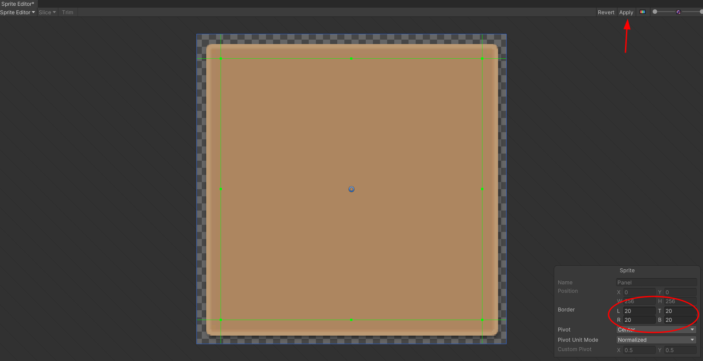

## Notes

### Ep 01

- Download assets https://devassets.com/assets/rpg-tutorial-assets/ and import unit package


- Change **colorset** from gamma to linear, *Project Settings > Player > Other Settings > Color Space*
-
- Enable **pivot** to see the origin at the bottom

- Player
  - Add capsule collider
  - Add Rigidbody: Enable is Kinematic to make it works with the
  - Add Nav Mesh Agent: this allows player movements
    - To set the walkable space:
      - Add Navigation window
      - To see the walkable areas *Navgation > Bake > Bake button*
      - Object marked as static: *Navigation > Object > Navigation Area*
      - Nav Mesh Obstacle and check carv to create an unwalkable area that updates in RT

- Raycasting: Add new layer called Ground

- New concepts
  - UnityEngine.AI, NavMeshAgent
  - RaycastHit, Ray, Physics.Raycast(), LayerMask
  - Camera concepts:
    - zoom
    - yaw
    - pitch

- To change the fog:
    

- Hints
  - In play mode copy component values and paste them after in edit mode

### Ep 02
TODO

### Ep 03

#### Importing the avatar
  - Error importing the animation clips [check this issue](https://issuetracker.unity3d.com/issues/using-multiple-animation-clips-in-blender-not-all-animation-clips-are-imported-using-a-blend-file)
  - Recommended is to open the blender file and export to fbx
  - Select T-pose, Apply and Done
  
  - COnfigure the animations
  


#### Setup animations in player

  - Create a new Animation (delete de PlayerAnimator)

  - In the *Player graphic* add an *Animator* component, and uncheck *Apply Root Motion*
  

  - Create new blend tree
  

  - In *Animator Controller* (called Player Graphic), open it, create a new *Blend Tree* and call it Locomotion, double click to enter in it
  


  - Add the 3 animations in the *Blend Tree*
  

  - The blend *parameter* rename it to *speedPercent*

### Ep 04

- heritance `ItemPickup : Interactable`
- For avoid error, check if *interactionTramsform* is null
- Instead of using json for data driven objects, use `Item : ScriptableObject`
- For override properties use **new**
- `[CreateAssetMenu()]` for creating a menu entry
  

### Ep 05

#### Import sprites


#### Fix sprite borders
- Install sprites 2D

- Mark borders

- Change image type in the consumer


#### Make the inventory to scale


#### Final setup
- delete the placeholder
- Disable the image
- Make close button non interactable
- change the disabled alpha


### Ep 06

- Useful methods:
`slots = itemsParent.GetComponentsInChildren<InventorySlot>();`

- avoiding moving the player when interacting with inventory.
```
using UnityEngine.EventSystems;

EventSystem.current.IsPointerOverGameObject()
```
- Add new buttons
`Input.GetButtonDown("Inventory")`


### Ep 08

- Export to FBX from Blender
- To avoid losing the settings, replace the Player.fbx right in the Character folder
- Extract the Materials and drop the smoothness to 0
- Unpack the player prefab, it's not needed

> If you have half of the clothes visible on the guy and the hair is all glitched just go to blender model and on hair, shirt, pants and shoes right click the corresponding collection then visiblity > enable in viewports and then save it reimport it in unity like Sebastian showed you to and you are good to go


#### Body interceptions
Control the blendShape value depending on what is the player wearing.

> Whoever is having a problem with blendShapes, I found a solution, that is if anyone is still taking this tutorial.
Before importing the character into unity, first open it up in blender, then without touching anything on the bottom right corner of the screen, you should see legs, arms torso, scroll under that and you'll see relative, uncheck that, and ur good to go.
Also if ur having issues with the default items showing up just half,  apply the mirror modifiers in the hair, pants, shirt and shoes, before exporting and that should fix it.
Lastly if ur at the end of the video and u reset the armor transform and they disappear, scale each one to 200 on the x, y and z. Pheww, that's it, hope someone finds this helpful, don't give up on ur gamedev journey and have fun

> Just an add on to this, if you have a set up in which untagging relative would break your setup, there are some other solutions depending on your issue.  If you're using code driven blendshapes but they're overwritten by an animation (usually one involving corrective shape keys), you can put all the logic that drives the blendshapes in your unity code into LateUpdate() (literally just type Late in front of the Update function).  This function will call at the end of the frame, I'm pretty sure it's the last thing called, and overwrite any baked animations you'd want to override.

#### Making pickup meshes
- Drop the skinned meshes into the scene
- Add the convert script to them
- Delete the mesh filter and mesh renderer from the pickups and put the new meshes inside
- Adjust box collider

#### New concepts
- SkinnedMeshRenderer
- MeshRenderer
- MeshFilter
- DestroyInmmediate()
- Instantiate<SkinnedMeshRenderer>(newItem.mesh)
- mesh.bones
- mesh.rootBone
- blendShapes
- casting enums
- [ContextMenu("Convert to regular mesh")]

### Ep 09
Nothing

### Ep 10

#### Create the enemy
Make sure the the enemy pivot is at the bottom


### Add nav mesh agent
Remember to use `using UnityEngine.AI;`

